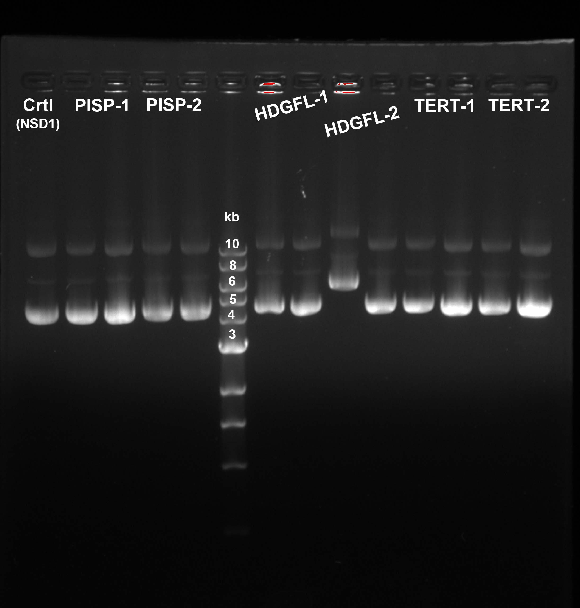

# Exp reader +NSD-H

------------------------

一个人走可以走的快，一群人走可以走的远

--------------

+ sgNSD2-Hela, H1299挑single clone
  + 各两个梯度：1:200, 1:1000
  + 1ml重悬，取15ul溶进3ml，各1ml放进1:200的皿里，剩2ml稀释成10ml，各取1ml放进1:1000的皿里
  + Blasticidin 90ul → 40ml medium，每个皿10ml，再加9ml正常Medium
+ sgSMC5:
  + 12 well-plate：1/2，1/4 seed → 有点多，下回可以6孔板中80-90%密度的话试试1/6种进去 (U2OS长太快了)
  + puro 1ug/ml for sgSMC5

| Date |      | Reader sgRNA                                                 | sgSMC5                                                       | sgNSD2-Hela/H1299                                            | K36M (GFP)0622 | sgFANCM (T2.1)0624 |
| ---- | ---- | ------------------------------------------------------------ | ------------------------------------------------------------ | ------------------------------------------------------------ | -------------- | ------------------ |
| 0623 | Thu  | purification Transfect H293T                              | Seed into 12-well plates for IF-FISH:   +puro 1μg/ml select U2OS 20%/well | Transfer for single clone Blasticidin 10μg/ml select day4 | change medium  |                    |
| 0624 | Fri  | LentiV2 transform split H293T Change Medium-LRG        | Thymidine 1:100                                              |                                                              |                | Infection          |
| 0625 | Sat  | 48h virals collect-LRG 4ml LB broth o/n                   | Remove thymidine Release  CDK1inhibitor                      |                                                              |                | Change Medium      |
| 0626 | Sun  | 72h virals collect-LRG purification-lentiV2 Tansfect H293T-lentiV2 | IF-FISH                                                      |                                                              | FACS day4      |                    |
| 0627 | Mon  | change Medium-lentiV2                                        |                                                              |                                                              |                |                    |
| 0628 | Tue  | 48h virals collect-lentiV2                                   |                                                              | Pick clone?                                                  |                | FACS day4          |
| 0629 | Wed  | 72h virals collect-lentiV2                                   |                                                              |                                                              |                |                    |
| 0630 | Thu  | U2OS+SaOS2  => for single colony                             |                                                              |                                                              | FACS day8      |                    |
| 0701 | Fri  | Change Medium                                                |                                                              |                                                              |                |                    |
| 0702 | Sat  | +Blasticidin select                                          |                                                              |                                                              |                | FACS day8          |
| 0703 | Sun  |                                                              |                                                              |                                                              |                |                    |
| 0704 | Mon  |                                                              |                                                              |                                                              |                |                    |
| 0705 | Tue  | seed into plates (1000, 2500/plate)                          |                                                              |                                                              |                |                    |

+ Purification of plasmid：too much LB both!!! E.coli didn't grow well. 2-4ml enough
+ LRG good to be transfected.lentiV2 retransform

+ 图里唯一一个不太行的质粒是pick的很小很小的一个clone，所以以后还是要选长得茁壮的，小的就不一定是出了什么问题，偶然间长起来了

+ 领导看了一下板子，觉得大的clone旁边有很小的clone，有几个可能：
  + 长的时间太长了，大的clone消化掉了周围的amp，使得有一些丢失目的质粒的E.coli也渗透过去并长了起来
  + 做的板子有问题，Amp浓度不够/倒的时候太热了导致Amp失效了

